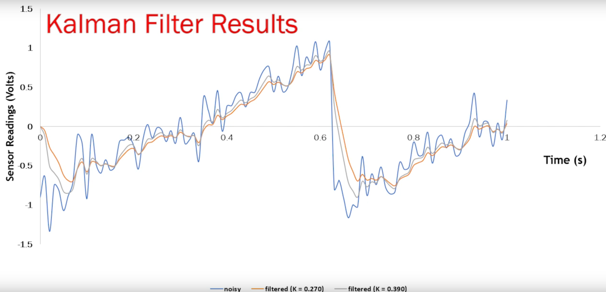
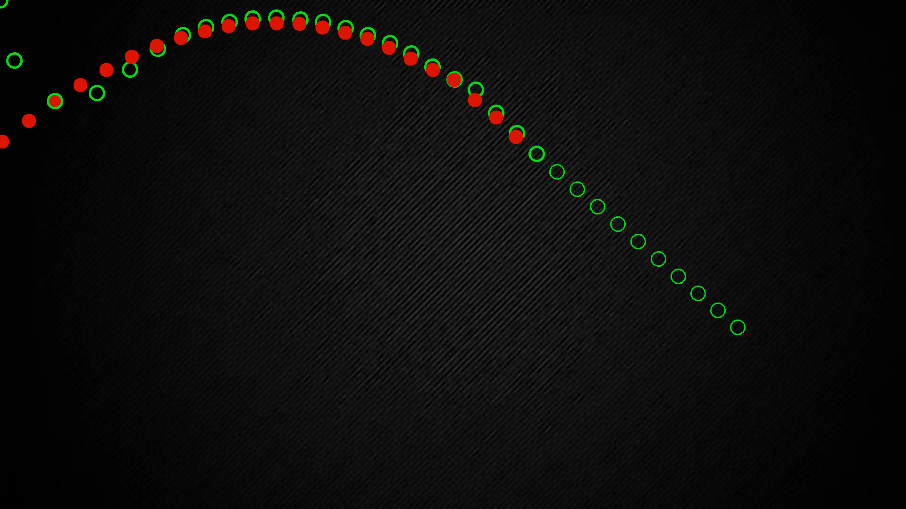

# State Estimation
Implementation of simple Kalman Filter for state prediction. 
Kalman filter is an algorithm that takes measurements
over time and creates a prediction of the next measurements. 
This is used in many fields such as sensors, GPS, to predict 
the position in case of signal loss for a few seconds and
this is what we will also see in computer vision.

* Simple state estimator using kalman filtering
```c++
class Kalmanfilter
{
    private:
        const double R = 40; //noise covariance (it's 10 initially)
        const double H = 1.0; //measurement map scaler
        double Q = 10; //initial estimated covariance
        double P = 0; // initial error covariance
        double predicted = 0; // initial estimated state 
        double k = 0; //initial kalman gain


    public:

        double predict(double measured)
            {
                k = P * H / (H * P * H + R); // update kalman gain
                
                predicted = predicted + k * (measured - H * predicted); // update estimated state

                P = (1 - k * H) * P + Q; // update error covariance

                return predicted;

            }


};
```
## Results
### 1. Reduction of noise in a random noisy signal



### 2. Trejectory Prediction
Red dots depicts measured data and green circles depicts 
predicted data.



### 3. [GPS denied positioning for Drone demo](https://www.youtube.com/watch?v=EmDbLCkKp1Q)
